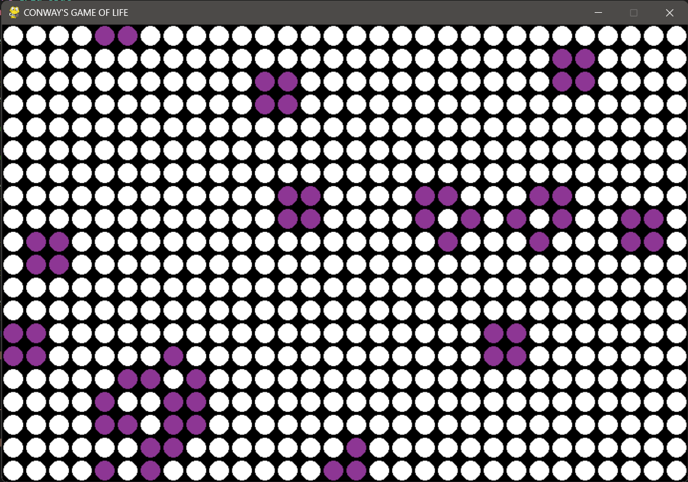
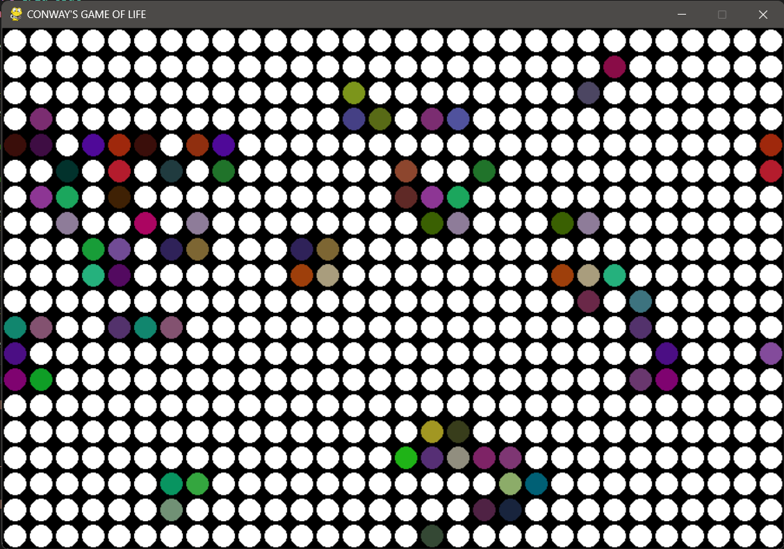
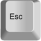

#   Conway's Game of Life </img> 
Conway's Game of Life is a game invented by John H. Conway to show the possibility of life continuation relative to the surrounding environment.
This simple pygame is just a simuation of his study.

   

<h3><ins>Scientific Idea behind the App</ins></h3>

<ul>
<li> This game simply represents the idea of 2D Cell Automata where the idea is to consider a set of adjacent cells representing a living environment in which a reproducable being live. </li>
<li>Each colorful cell represents a being and the white ones are dead being or empty space. </li>
<li>The rule of surviving or dying is followed by these three simple rules:   
<ol type="1">
<li> If number of alive neighbour cells =< 2, then it dies of loneliness. </li>
<li> If number of alive neighbour cells >= 5, then it dies of overcrowding. </li>
<li> If the number of alive neighbours = 3, then it survives as it procreates. </li>
</ol >
</li>
</ul>

##  To directly play Conway's Game of Life:
+ Download the [zipped folder](https://github.com/KatrineAshraf/Conway-s-game-of-life/blob/e7b2dc65fee9f6057b0d052232c380875f82523c/Conways_Game_of_Life.zip) in my repository.
+ Extract the zip folder.
+ Run the `Conways Game of Life.exe` file.
>[!CAUTION]
> The executable file could mal-function if removed from the final extracted folder.

## To play from source code:
+ Clone the repository or download it and open it with any python interpreter.
+ `pip install pygame` or simply ignore if requirement is satisifed.
+ Run the `Main_Updt.py` file.

>[!TIP]
>When running the game from source code, there's another function that's hashed in "Main_Updt.py" file.
>When Unhashed, you can point at a cell in the game and press 'X' button and in the terminal, you can see its life prediction for the next state.

## Game Controls
| Controls | Description|
| :---: | :----: |
| | Pause/Resume the automation|
| | Quit Game|
|| Create a Cell|
|| Delete a Cell|
|| Change Color Mode |
|| Next color(s)|
|| Previous color(s)|

